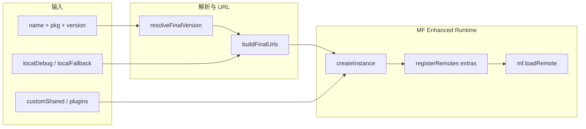

# fan-mf-runtime：在 Module Federation 之上做了什么

本文说明 `packages/fan-mf-runtime` 在 **Module Federation 运行时**（以 `@module-federation/enhanced` 与 `@module-federation/bridge-react` 为底座）之上提供的**增值层**：解决了哪些问题、暴露哪些 API、与「裸用 MF」的分工边界。

---

## 1. 头脑风暴：为什么需要这一层？

**裸用 MF 时**，常见痛点包括：

- **入口 URL 固定**：构建期写死 `remoteEntry`，难以按 npm 包名 + 语义化版本动态拼 CDN。
- **`latest` 与缓存**：每次拉 registry 成本高；全量跟 `latest` 又可能抖动；需要 TTL + 后台 revalidate。
- **CDN 单点**：jsDelivr / unpkg 任一挂掉时缺少顺序降级。
- **运行时实例策略**：多远程、多版本、重复 `createInstance` 时的去重与并发中的单飞（in-flight dedupe）。
- **React 共享**：Vue 宿主通过 `window.React` 注入时，需要把 **global lib** 合进 `shared`，避免 remote 抢 React。
- **生命周期**：预加载、卸载、`cleanup`、本地版本缓存清理等，MF 核心不替你收口。
- **可观测与协作**：健康检查、跨微前端事件总线等属于「平台能力」。

**本库的定位**：在 **Enhanced Runtime**（`createInstance`、`registerRemotes`、`loadRemote`、插件模型）之上，提供 **「按 npm 包加载远程 + 默认 shared + CDN/版本策略 + 工具箱」**，并把 **Bridge React** 的懒加载/预取能力以统一入口再导出。

---

## 2. 技术底座（本包直接依赖的 MF 生态）

| 依赖 | 角色 |
|------|------|
| `@module-federation/enhanced` | `createInstance`、运行时插件类型、`getInstance`（用于 `prefetchComponent`）等 |
| `@module-federation/bridge-react` | `createBridgeComponent`（v18/v19）、`createRemoteAppComponent`、`createRemoteComponent`、`lazyLoadComponentPlugin` |

本包 **不替代** Webpack/Rspack 侧的 MF 插件配置；它侧重 **浏览器运行时** 如何创建实例、注册 remote、加载模块。

---

## 3. 能力地图（相对「纯 MF」多做了什么）

### 3.1 加载器：`loadRemoteMultiVersion` + `loader/utils`

- **版本解析**：`resolveFinalVersion` 处理 `latest`；结合 `localStorage`（`mf-multi-version`）与 `cacheTTL`；可选 `revalidate` 在后台拉 npm `dist-tags.latest` 更新缓存。
- **CDN URL**：`buildCdnUrls` / `buildFinalUrls` 默认 **jsDelivr → unpkg** 模板 `{pkg}@{version}/dist/remoteEntry.js`，并支持 `localFallback`、`localDebug.entry` 直跳本地 entry。
- **故障转移**：`loadRemoteMultiVersion` 按 URL 列表依次 `tryLoadRemote`，失败则换下一 CDN并 `console.warn`。
- **运行时实例**：`tryLoadRemote` 内 `createInstance({ name: 'host', remotes: [...], shared, plugins })`；**实例缓存** `mfInstanceCache` + **加载中单飞** `mfInstanceLoadingCache`；支持 `retries` / `delay` 在**同一 URL** 上的重试。
- **额外 remotes**：`LoadRemoteExtraOptions` 支持 `remoteSourcePlugins` / `baseRemotes`，在 `resolveRegisteredRemotes` 中合并、去重，并在主 remote 注册后 `mf.registerRemotes(extraRemotes, registerOptions)`（用于依赖多个入口或平台注入的 remote 列表）。
- **共享模块默认项**：`DEFAULT_SHARED_CONFIG` 为 react / react-dom / client / jsx 等配置 **singleton + eager + loaded-first**；`getFinalSharedConfig` 若检测到 **有效的** `window.React` / `ReactDOM`，则合并 **带 `lib()` 的全局实例**，便于 **Vue 宿主** 与 remote 共用同一 React。

### 3.2 运行时插件

- **`fallbackPlugin`**：挂到 `createInstance` 的 `plugins`；在 `errorLoadRemote` 中记录并 **重新抛出** 可读错误（避免静默失败）。

### 3.3 Remote 来源插件（扩展点）

- **`RemoteSourcePlugin`**：`registerRemotes(context)` 返回额外 `RuntimeRemote[]`。
- **`createRemoteSourcePlugin(name, remotes)`**：静态列表工厂。

### 3.4 预加载：`preload/*`

- **`preloadRemote` / `preloadRemoteList`**：内部调用 `loadRemoteMultiVersion`；内存缓存 `PRELOAD_CACHE_TTL`（默认 5 分钟）；`priority: 'idle' | 'high'`（idle 时用 `requestIdleCallback` 或 `setTimeout` 降级）。

### 3.5 卸载与登记：`unload/*`

- 维护 `remoteInstances` Map；**`unloadRemote`** 匹配 name/pkg/version，调用 **`mf.cleanup()`**（若存在）、清理已加载模块集合；可选 **`clearCache`** 清理 `localStorage` 中对应包的版本缓存。
- **`unloadAll`**、`getLoadedRemotes`、`isRemoteLoaded`、`registerRemoteInstance`、`registerLoadedModule` 等用于宿主侧生命周期与调试。

### 3.6 健康检查：`health/*`

- **`checkRemoteHealth`**：对多 CDN 模板做 **HEAD** 请求（超时 5s），得到可达性、延迟、`healthy | degraded | unhealthy`。
- **`getRemoteHealthReport`**：批量聚合 overall 状态。
- **`checkModuleLoadable`**：对已有 `mf` 实例执行 `loadRemote(\`${scopeName}/${modulePath}\`)` 判断是否可加载（用于冒烟/诊断）。

### 3.7 事件总线：`event-bus/*`

- 与 MF 无强耦合的 **`EventBusClass`**：`on` / `once` / `off` / `emit`、可选 filter、事件历史（上限 100）、默认单例 **`eventBus`** 与 **`createEventBus()`**。

### 3.8 版本工具：`version/*` 与 `version/react`

- 语义化比较、`satisfiesVersion`、兼容矩阵、从 registry 拉可用版本等（供上层做 **React 版本对齐** 或策略选择）；**`loadReactVersion`** 等与 React 版本加载相关的辅助（详见源码导出）。

### 3.9 Bridge 层：`bridge/*`

- **`useLazyComponent` / `createLazyComponent`**：`loader()` 返回模块后解析 **default 或具名 export**；统一 **loading / error fallback**、可选 **`delayLoading`**；对非法组件类型做兜底错误。
- **`createLazyLoadComponentPlugin`**：对 `@module-federation/bridge-react` 的 `lazyLoadComponentPlugin` 的再导出，便于与 **`prefetchComponent`** 配合。
- **`prefetchComponent`**：从 **`@module-federation/enhanced/runtime` 的 `getInstance()`** 取实例并调用其 **`prefetch`**（需宿主已注册 lazy load 插件）。

### 3.10 应用桥接再导出：`app_bridge/*`

- 将 **`createBridgeComponent`（v18/v19）**、**`createRemoteAppComponent` / `createRemoteComponent`** 从官方 bridge-react **原样导出**。
- **`createBridgeRemoteApp`**：对 `createRemoteAppComponent` 的薄封装，收紧对外类型（`BridgeAppComponent` 等）。

---

## 4. 数据流（简化）

---

## 5. 与仓库内其它包的关系

- **`@yunfan/react-adapter`**：通常组合 **`RemoteModuleProvider` / `lazyRemote` / `useRemoteModuleHook`**，内部可调用本库的 **`loadRemoteMultiVersion`** 等。
- **`@yunfan/vue-adapter`**：Vue 侧消费 React remote 时，依赖宿主把 React 挂到 **`window`**；本库 **`getFinalSharedConfig`** 识别全局 React 并写入 **shared**，减少双 React 问题。

---

## 6. 边界与注意点

- **约定式路径**：默认假设 npm 包在 **`/dist/remoteEntry.js`** 下暴露 MF entry；若包结构不同，需自定义 URL 或 `localDebug` / `localFallback`。
- **`prefetchComponent`** 依赖 **宿主构建侧** 已接入 enhanced runtime 且注册 **lazyLoadComponentPlugin**；否则会有 `console.warn`。
- **卸载**：依赖 MF 实例暴露的 **`cleanup`** 语义；与浏览器里已执行的脚本副作用（全局单例、DOM 节点）仍需业务层配合。
- **健康检查** 的 `details.remoteEntryValid` / `modulesLoadable` 在 `checkRemoteHealth` 中部分为占位语义；完整深度校验可走 **`checkModuleLoadable`**。

---

## 7. 源码目录速查

| 目录/文件 | 职责 |
|-----------|------|
| `src/loader/index.ts` | `loadRemoteMultiVersion` 编排 |
| `src/loader/utils.ts` | CDN、缓存、npm、`tryLoadRemote`、`getFinalSharedConfig` |
| `src/loader/remote-source/index.ts` | Remote 来源插件与 `registerRemotes` 合并 |
| `src/plugins/fallback.ts` | 运行时 `errorLoadRemote` 插件 |
| `src/preload/index.ts` | 预加载与短 TTL 内存缓存 |
| `src/unload/index.ts` | 实例登记、卸载、版本缓存清理 |
| `src/health/index.ts` | CDN HEAD 与聚合报告 |
| `src/event-bus/index.ts` | 进程内事件总线 |
| `src/version/*` | 版本解析与兼容工具 |
| `src/bridge/*` | 懒加载 React API + prefetch 胶水 |
| `src/app_bridge/*` | bridge-react 官方 API 聚合导出 + `createBridgeRemoteApp` |
| `src/index.ts` | 包对外统一导出 |

---

## 8. 总结一句话

**fan-mf-runtime** 在 **Module Federation Enhanced + Bridge React** 之上，补齐了 **「npm 包 + 动态版本 + 多 CDN + 缓存/revalidate + 默认 React shared（含 Vue 全局 React）+ 实例缓存/预加载/卸载/健康/事件总线」** 这一整条 **运行时加载与治理** 能力链；Bridge 相关 UI 懒加载与预取则 **对齐官方 bridge-react**，通过本库做 **统一入口与类型收口**。

---

*文档生成自仓库源码结构分析，若 API 有变更请以 `src/index.ts` 与各模块实现为准。*
